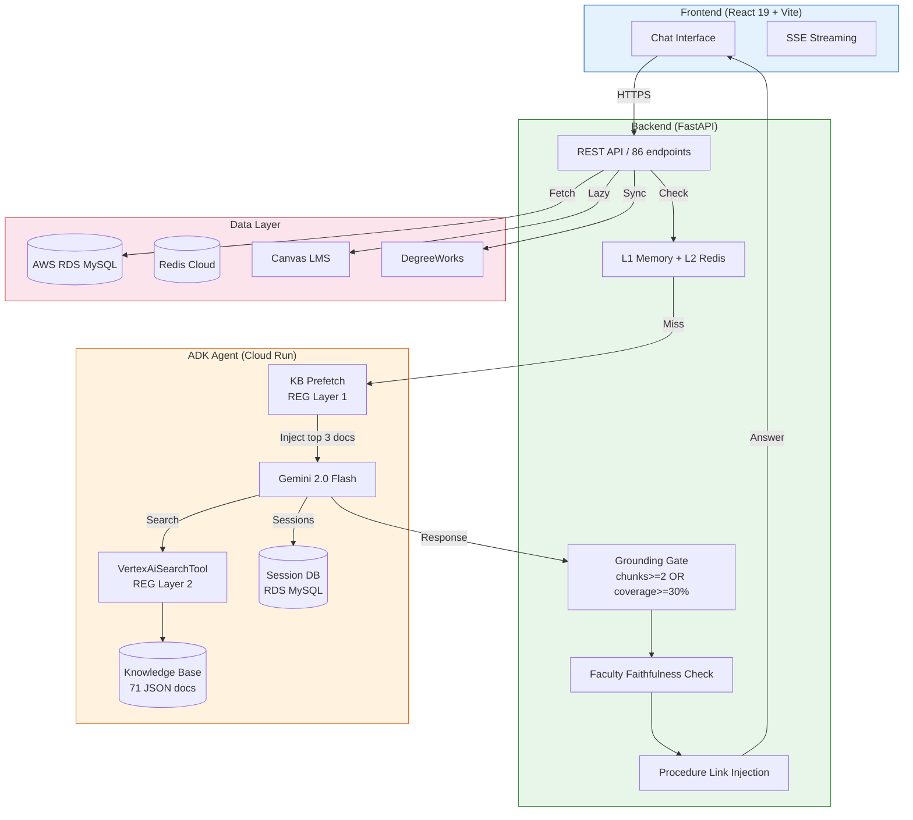
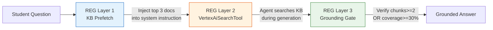
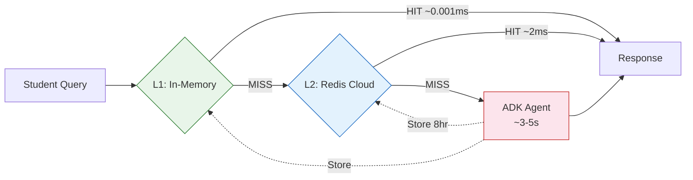
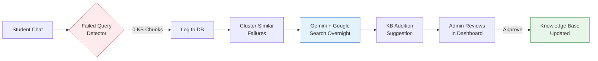
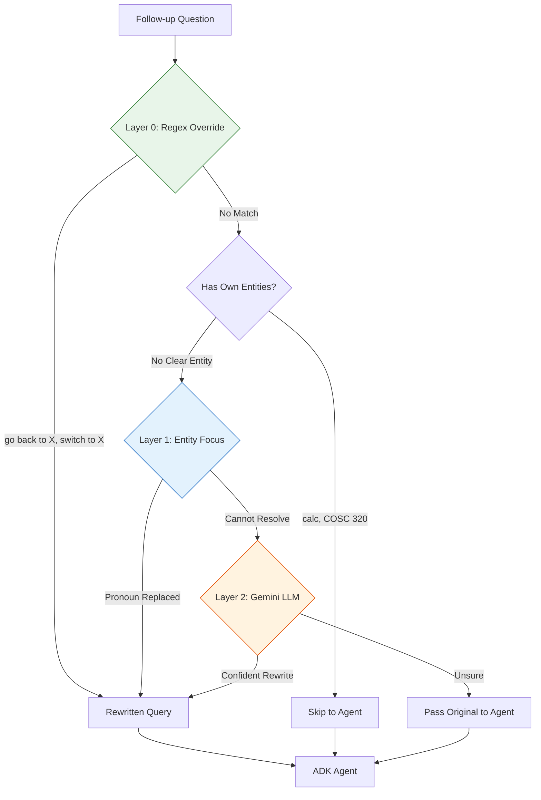

<h1 align="center">CS Navigator</h1>
<p align="center"><strong>AI-Powered Academic Advising for Morgan State University</strong></p>
<p align="center">
  <a href="https://cs.inavigator.ai">Live App</a> |
  <a href="https://api.inavigator.ai/docs">API Docs</a> |
  <a href="#architecture">Architecture</a> |
  <a href="#version-history">Version History</a>
</p>
<p align="center">
  <a href="https://github.com/theaayushstha1/cs-navigator/actions"></a>
  <a href="https://github.com/theaayushstha1/cs-navigator/releases/tag/v5.1"></a>
  
  
  
  
  <a href="https://github.com/theaayushstha1/cs-navigator/blob/main/LICENSE"></a>
</p>

---

CS Navigator is a production AI chatbot serving 800+ CS students at Morgan State University. Students ask questions in plain English and get personalized answers grounded in the department's knowledge base, their DegreeWorks academic record, and Canvas LMS grades.

Built with Google ADK (Agent Development Kit), Gemini 2.0 Flash, and Vertex AI Search. Uses a novel **Retrieval-Enforced Generation (REG)** pipeline that guarantees KB grounding at three layers: pre-generation context injection, tool-based retrieval, and post-generation verification. Zero hallucinations across 200+ tested queries with 3.9s average response time.

Deployed on Google Cloud Run with multi-instance scaling, database-backed session persistence, and a 2-tier caching system.

---

## Demo

<p align="center">
  
  <br><em>Ask questions, get personalized answers grounded in university data</em>
</p>

### Features: Curriculum, My Classes, Grade Surgeon, Ripple Effect

<p align="center">
  
  <br><em>Track degree progress, view grades, analyze course impact</em>
</p>

### Personalized Advising with DegreeWorks

<p align="center">
  
  <br><em>Agent reads your academic record and gives tailored answers</em>
</p>

### Admin Dashboard

<p align="center">
  
  <br><em>Manage knowledge base, users, tickets, research pipeline, system health</em>
</p>

---

## Architecture



### Retrieval-Enforced Generation (REG) Pipeline

Unlike standard RAG where the LLM optionally calls a retrieval tool, REG enforces KB grounding at every stage:



**Layer 1 (Pre-Generation):** `kb_prefetch.py` searches 71 cached KB docs with TF-IDF scoring in <5ms and injects the top 3 matches into the system instruction via ADK's `before_model_callback`. Even if Gemini skips the search tool, the relevant docs are already in the prompt.

**Layer 2 (During Generation):** The agent has `VertexAiSearchTool` to search the KB. This is standard RAG.

**Layer 3 (Post-Generation):** Grounding gate checks if the response is backed by KB evidence (requires 2+ source chunks or 30% coverage). Faculty faithfulness check catches hallucinated professor names. Procedure link injection appends Google Drive guide URLs.

### Caching Flow



L3 semantic cache uses Google text-embedding-004 with 0.95 cosine threshold. Catches rephrased versions of the same question (e.g., "where is the CS dept" matches "CS department location") and saves a full 4-second Gemini call.

### Self-Healing Research Pipeline



### Follow-Up Resolution



---

## Tech Stack

| Layer | Technology | Why |
|-------|-----------|-----|
| **Frontend** | React 19, Vite, TailwindCSS | PWA support, SSE streaming, fast builds |
| **Backend** | FastAPI (Python 3.12) | Async, 86 endpoints, modular routers |
| **AI Agent** | Google ADK + Gemini 2.0 Flash | Fastest model, highest rate limits, 100% accuracy |
| **REG Layer 1** | KB Prefetch (TF-IDF, <5ms) | Pre-injects top 3 KB docs into prompt via `before_model_callback` |
| **REG Layer 2** | Vertex AI Search (71 docs) | Agent's built-in VertexAiSearchTool with grounding metadata |
| **REG Layer 3** | Grounding Gate + Faithfulness | Post-generation: coverage check, faculty name validation, link injection |
| **Database** | AWS RDS MySQL | Users, chat history, DegreeWorks, Canvas, ADK sessions |
| **Cache** | L1 In-Memory + L2 Redis + L3 Semantic | 3-tier: exact match (L1+L2) + embedding similarity at 0.95 (L3) |
| **Testing** | Promptfoo (52 tests) | Backend pipeline tests + CI gate at 90% threshold |
| **Deployment** | Google Cloud Run (3 services) | Auto-scaling, min-instances=2, DatabaseSessionService |

---

## Key Features

| Feature | How It Works |
|---------|-------------|
| **REG Pipeline** | Retrieval-Enforced Generation: 3-layer grounding (prefetch + tool search + verification). Unlike RAG where retrieval is optional, REG guarantees KB context at every stage. Addresses the parametric memory dominance problem (ReDeEP, 2025). |
| **Grounding Gate** | Coverage-based quality check: requires chunks>=2 OR coverage>=30%. Faculty faithfulness check catches hallucinated professor names. Procedure link injection appends Google Drive guide URLs. |
| **3-Layer Follow-Up Resolver** | Layer 0: regex override detection ("go back to X"). Layer 1: deterministic entity focus from last Q&A. Layer 2: Gemini LLM fallback. Prevents context bleed between topics. |
| **Course Context Engine** | Pre-computes prereqs, schedules, faculty cards on the backend and injects into agent session state. Workaround for Gemini API limitation that blocks mixing search + function tools. |
| **Self-Healing Research Pipeline** | Detects failed queries, clusters them with embeddings, researches corrections using Gemini + Google Search, suggests KB additions. Runs overnight via cron. |
| **DatabaseSessionService** | ADK sessions stored in shared RDS instead of in-memory per instance. Eliminates 404 errors during scaling and deploys. 24-hour session TTL for all-day conversation continuity. |
| **Canvas LMS Integration** | Pulls grades, assignments, deadlines via Canvas REST API. Lazy-loads only when query mentions grades/assignments. |
| **DegreeWorks Integration** | Parses academic records via PDF upload or Banner auto-sync. Injects GPA, completed courses, remaining requirements into agent context. |
| **Red Team Hardened** | 43-category Promptfoo security audit. 9 agent-level security rules blocking jailbreaks, role-play, calibration framing, and self-disclosure attacks. |
| **Guest Mode** | 15-minute free trial. Personal queries (GPA, grades) intercepted and redirected to signup. No fabricated data. |
| **3-Tier Caching** | L1 in-memory (instant) + L2 Redis (8hr TTL) + L3 semantic embedding (0.95 cosine, catches rephrased questions). Greeting and meta fast-paths skip the agent entirely. |
| **Model Selection** | ChatGPT-style dropdown: iNav (fast, Gemini 2.0 Flash) and iNav Pro (deeper thinking, Gemini 2.5 Flash). Benchmarked 7 models across accuracy and latency. |

---

## Design Decisions

| Decision | Alternatives Considered | Why This Approach |
|----------|------------------------|-------------------|
| **Single unified agent** (v4+) | 8-specialist multi-agent (v3) | 3x faster response time. Multi-agent had routing overhead and inconsistent handoffs. |
| **Backend pre-computation** over agent tools | FunctionTool in ADK | Gemini API blocks mixing VertexAiSearchTool with FunctionTool. Pre-compute on backend, inject via session state. |
| **DatabaseSessionService** over in-memory | Session affinity cookies | Affinity is best-effort only. Breaks on deploys, scale-in, instance recycling. DB sessions survive everything. |
| **Grounding gate** over coverage metric | Vertex AI Search coverage score | Coverage always returns 100% (useless). Chunk count is the reliable signal. |
| **24-hour session TTL** | 30 minutes | Students leave for class and come back hours later. DW data changes weekly at most. Context hash forces refresh on data changes anyway. |
| **Query rewriter skips clear entities** | Always apply previous turn's focus | Prevented context bleed (Dean's List answer bleeding into calc grade question). |

---

## Performance

Results from production benchmark (50 authenticated queries, April 9 2026):

| Metric | Value |
|--------|-------|
| **Pass Rate** | 100% (50/50) |
| **Hallucinations** | 0 |
| **Avg Response Time** | 3.9s |
| **Median Response** | 4.0s |
| **Min Response** | 2.4s |
| **Max Response** | 6.4s |
| **Drive Links** | 7/50 (all procedure questions) |

| Category | Pass | Total | Avg Time |
|----------|------|-------|----------|
| Courses & Prerequisites | 10 | 10 | 3.8s |
| Schedules | 5 | 5 | 4.3s |
| Faculty & Department | 8 | 8 | 4.2s |
| Degree Requirements | 5 | 5 | 3.6s |
| Programs & Tracks | 4 | 4 | 4.7s |
| Financial Aid | 6 | 6 | 2.9s |
| Procedures (with Drive links) | 7 | 7 | 3.5s |
| Campus Resources | 3 | 3 | 4.2s |
| Career | 2 | 2 | 2.9s |

### Accuracy Evolution

| Version | Pass Rate | Avg Response | Hallucinations | Instruction Size |
|---------|-----------|-------------|----------------|-----------------|
| v4.0 | 39% | 12s | Frequent | 8,000 chars |
| v5.0 | 95.4% | 6.1s | Rare | 14,090 chars |
| **v5.1 (REG)** | **100%** | **3.9s** | **Zero** | **3,903 chars** |

---

## Version History

| Version | Branch Tag | Key Changes |
|---------|-----------|-------------|
| **v5.1** | `dev` | REG pipeline (kb_prefetch + grounding gate + faithfulness check), instruction compression (14K to 3.9K chars), 16 accuracy fixes, model benchmarking (7 models), DB sessions via aiomysql, promptfoo CI gate, router pattern, model selector UI |
| **v5.0** | `main` | DatabaseSessionService, grounding gate, 3-layer resolver, course context engine, Canvas integration, 43-category red team audit, guest fake data removal |
| **v4.3** | `v4.3-research` | Auth system (email verification, password reset), auto-research pipeline, structured KB v7 |
| **v4.0** | `v4.0-accuracy` | Agent accuracy fix (39% to 100%), semantic caching, fresh session strategy |
| **v3.0** | `v3.0-multi-agent` | 8-specialist multi-agent architecture, Promptfoo security tests |
| **v2.2** | `v2.2-caching` | Multi-tier Redis caching, SSE streaming |
| **v2.0** | `v2.0-adk` | Google ADK migration, replaced RAG pipeline |
| **v1.0** | `v1.0-rag` | Original RAG with Pinecone + OpenAI GPT-3.5 |

All previous versions are accessible via git tags: `git checkout v3.0-multi-agent`

---

## Local Development

```bash
# Clone
git clone https://github.com/theaayushstha1/cs-chatbot-morganstate.git
cd cs-chatbot-morganstate

# Copy and fill environment variables
cp .env.example .env

# Start ADK Agent (port 8080)
cd adk_agent && pip install google-adk && adk web . --port 8080

# Start Backend (port 5001)
cd backend && pip install -r requirements.txt && uvicorn main:app --host 127.0.0.1 --port 5001

# Start Frontend (port 3000)
cd frontend && npm install && npm run dev -- --port 3000
```

---

## Deployment

Three services on Google Cloud Run:

```bash
# 1. ADK Agent
gcloud run deploy csnavigator-adk --source=./adk_agent \
  --region=us-central1 --memory=2Gi --cpu=2 --min-instances=2

# 2. Backend API
gcloud run deploy csnavigator-backend --source=./backend \
  --region=us-central1 --memory=1Gi --cpu=1 --min-instances=2

# 3. Frontend
gcloud run deploy csnavigator-frontend --source=./frontend \
  --region=us-central1 --memory=512Mi --cpu=1 --min-instances=1
```

---

## Project Structure

```
cs-chatbot-morganstate/
  frontend/                     React 19 + Vite SPA
    src/components/             Chat, Sidebar, Profile, Admin, Curriculum
    public/                     Static assets (WebP optimized)
    Dockerfile                  Cloud Run container

  backend/                      FastAPI (Python 3.12)
    main.py                     API server (86 endpoints)
    vertex_agent.py             ADK client, grounding gate, faithfulness check
    cache.py                    L1 + L2 caching (semantic L3 available)
    deps.py                     Shared dependencies (auth, models)
    routers/auth.py             Auth endpoints (router pattern)
    research_agent.py           Self-healing failed query pipeline
    services/
      course_context.py         Prereq, schedule, faculty pre-computation
      query_rewriter.py         Follow-up resolver (regex + gated LLM)
      context_builders.py       DW + Canvas context injection
      retrieval_gate.py         Pre-agent KB search (admin utility)
      verification_gate.py      Post-agent claim verification (admin utility)
      fast_retrieval.py         In-memory TF-IDF search (admin utility)
      hybrid_retrieval.py       Pinecone + Vertex AI RRF (admin utility)
    kb_structured/              71 JSON knowledge base documents
    legacy_rag/                 Archived Pinecone-era scripts (v1.0-v2.0)
    Dockerfile                  Cloud Run container

  adk_agent/                    Google ADK Agent
    cs_navigator_unified/
      agent.py                  Agent definition, REG Layer 1 callback
      kb_prefetch.py            In-memory TF-IDF KB prefetch (<5ms)
      promptfooconfig.yaml      52 regression tests
      backend_provider.py       Promptfoo provider for full pipeline
      run_tests.sh              CI gate script (90% threshold)
    Dockerfile                  Cloud Run + DatabaseSessionService

  docs/                         Documentation and evidence
  deploy-cloudrun.sh            Deployment script
```

---

## Team

Built under the guidance of **Dr. Shuangbao "Paul" Wang**, Professor and Chair of Computer Science at Morgan State University.

| Name | Role |
|------|------|
| **Aayush Shrestha** | Lead Developer. ADK agent architecture, backend systems, Canvas/DegreeWorks integration, caching, security hardening, Cloud Run deployment. |
| **Sakina Shrestha** | Developer. RAG pipeline (v1.0), agent contributions, frontend development. |
| **Dr. Shuangbao "Paul" Wang** | Faculty Advisor. Research direction, department coordination, testing oversight. |

## Contributing

To contribute:
1. Fork the repository
2. Create a feature branch (`git checkout -b feature/your-feature`)
3. Commit your changes
4. Push to the branch
5. Open a Pull Request

---

## License

MIT License. See [LICENSE](./LICENSE) for details.

---

<p align="center">
  Built at Morgan State University | Department of Computer Science
  <br>
  <a href="https://cs.inavigator.ai">cs.inavigator.ai</a>
</p>
