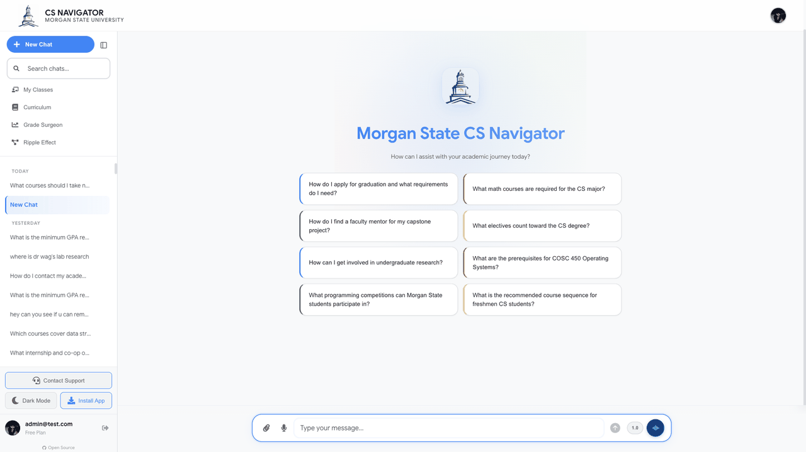
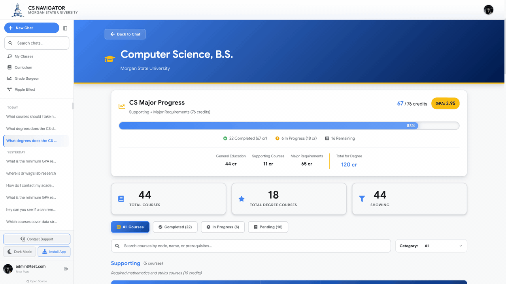
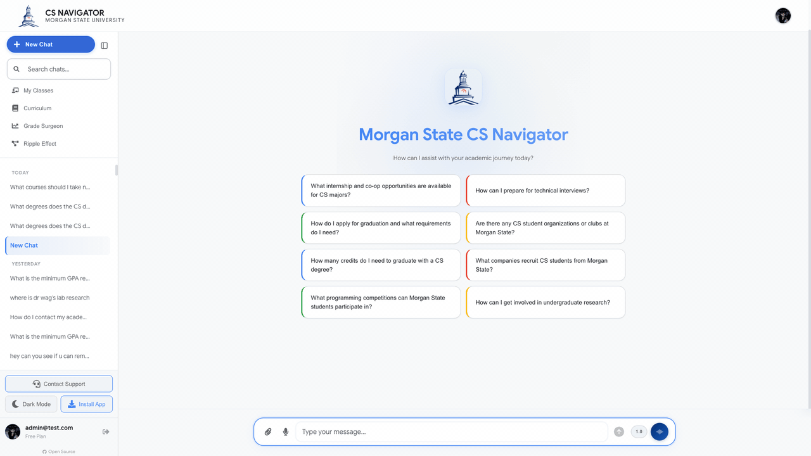
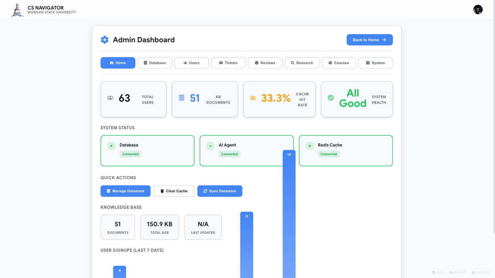
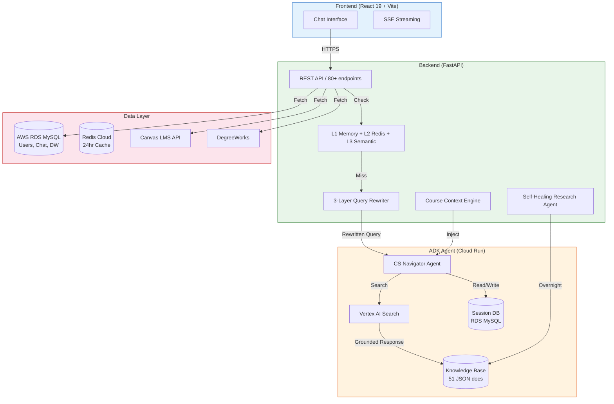
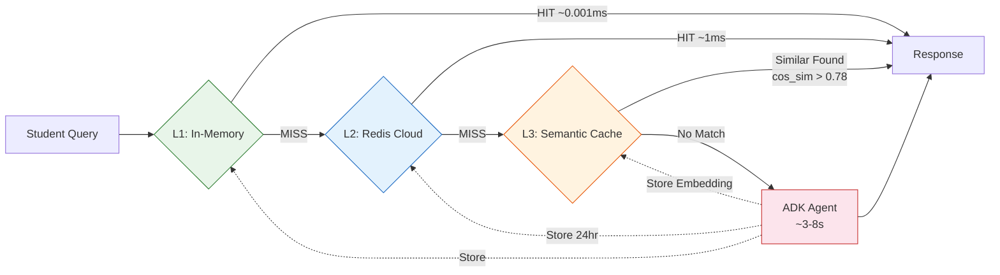
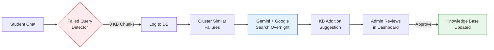
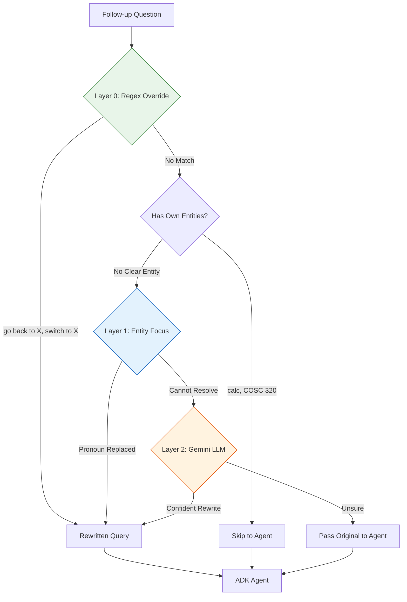

<h1 align="center">CS Navigator</h1>
<p align="center"><strong>AI-Powered Academic Advising for Morgan State University</strong></p>
<p align="center">
  <a href="https://cs.inavigator.ai">Live App</a> |
  <a href="https://api.inavigator.ai/docs">API Docs</a> |
  <a href="#architecture">Architecture</a> |
  <a href="#version-history">Version History</a>
</p>
<p align="center">
  <a href="https://github.com/theaayushstha1/cs-navigator/actions"></a>
  <a href="https://github.com/theaayushstha1/cs-navigator/releases/tag/v5.0"></a>
  
  
  
  <a href="https://github.com/theaayushstha1/cs-navigator/blob/main/LICENSE"></a>
</p>

---

CS Navigator is a production AI chatbot serving 800+ CS students at Morgan State University. Students ask questions in plain English and get personalized answers grounded in the department's knowledge base, their DegreeWorks academic record, and Canvas LMS grades.

Built with Google ADK (Agent Development Kit), Gemini 2.5 Flash, and Vertex AI Search. Deployed on Google Cloud Run with multi-instance scaling, database-backed session persistence, and a 3-tier caching system.

---

## Demo

<p align="center">
  
  <br><em>Ask questions, get personalized answers grounded in university data</em>
</p>

### Features: Curriculum, My Classes, Grade Surgeon, Ripple Effect

<p align="center">
  
  <br><em>Track degree progress, view grades, analyze course impact</em>
</p>

### Personalized Advising with DegreeWorks

<p align="center">
  
  <br><em>Agent reads your academic record and gives tailored answers</em>
</p>

### Admin Dashboard

<p align="center">
  
  <br><em>Manage knowledge base, users, tickets, research pipeline, system health</em>
</p>

---

## Architecture



### Caching Flow



### Self-Healing Research Pipeline



### Follow-Up Resolution



---

## Tech Stack

| Layer | Technology | Why |
|-------|-----------|-----|
| **Frontend** | React 19, Vite, TailwindCSS | PWA support, SSE streaming, fast builds |
| **Backend** | FastAPI (Python 3.11) | Async, 80+ endpoints, 4,200 lines |
| **AI Agent** | Google ADK + Gemini 2.5 Flash | Grounded responses from structured KB |
| **Knowledge Base** | Vertex AI Search (51 docs) | Semantic search with grounding metadata |
| **Database** | AWS RDS MySQL | Users, chat history, DegreeWorks, Canvas data |
| **Session Store** | DatabaseSessionService (RDS) | Multi-instance session persistence |
| **Cache L1** | In-Memory TTLCache | ~0.001ms, hot queries |
| **Cache L2** | Redis Cloud | ~1ms, 24hr TTL, distributed |
| **Cache L3** | Semantic Embedding Cache | Cosine similarity 0.78 threshold |
| **Deployment** | Google Cloud Run (3 services) | Auto-scaling, min-instances=2 |

---

## Key Features

| Feature | How It Works |
|---------|-------------|
| **Grounding Gate** | Counts KB chunks returned by Vertex AI Search. Appends a disclaimer when the agent has 0 evidence but still responded. Catches hallucinations before they reach students. |
| **3-Layer Follow-Up Resolver** | Layer 0: regex override detection ("go back to X"). Layer 1: deterministic entity focus from last Q&A. Layer 2: Gemini LLM fallback. Prevents context bleed between topics. |
| **Course Context Engine** | Pre-computes prereqs, schedules, faculty cards on the backend and injects into agent session state. Workaround for Gemini API limitation that blocks mixing search + function tools. |
| **Self-Healing Research Pipeline** | Detects failed queries, clusters them with embeddings, researches corrections using Gemini + Google Search, suggests KB additions. Runs overnight via cron. |
| **DatabaseSessionService** | ADK sessions stored in shared RDS instead of in-memory per instance. Eliminates 404 errors during scaling and deploys. 24-hour session TTL for all-day conversation continuity. |
| **Canvas LMS Integration** | Pulls grades, assignments, deadlines via Canvas REST API. Lazy-loads only when query mentions grades/assignments. |
| **DegreeWorks Integration** | Parses academic records via PDF upload or Banner auto-sync. Injects GPA, completed courses, remaining requirements into agent context. |
| **Red Team Hardened** | 43-category Promptfoo security audit. 9 agent-level security rules blocking jailbreaks, role-play, calibration framing, and self-disclosure attacks. |
| **Guest Mode** | 15-minute free trial. Personal queries (GPA, grades) intercepted and redirected to signup. No fabricated data. |
| **3-Tier Caching** | L1 in-memory (instant) + L2 Redis (distributed) + L3 semantic similarity (catches rephrased questions). Greeting fast-path skips the agent entirely. |

---

## Design Decisions

| Decision | Alternatives Considered | Why This Approach |
|----------|------------------------|-------------------|
| **Single unified agent** (v4+) | 8-specialist multi-agent (v3) | 3x faster response time. Multi-agent had routing overhead and inconsistent handoffs. |
| **Backend pre-computation** over agent tools | FunctionTool in ADK | Gemini API blocks mixing VertexAiSearchTool with FunctionTool. Pre-compute on backend, inject via session state. |
| **DatabaseSessionService** over in-memory | Session affinity cookies | Affinity is best-effort only. Breaks on deploys, scale-in, instance recycling. DB sessions survive everything. |
| **Grounding gate** over coverage metric | Vertex AI Search coverage score | Coverage always returns 100% (useless). Chunk count is the reliable signal. |
| **24-hour session TTL** | 30 minutes | Students leave for class and come back hours later. DW data changes weekly at most. Context hash forces refresh on data changes anyway. |
| **Query rewriter skips clear entities** | Always apply previous turn's focus | Prevented context bleed (Dean's List answer bleeding into calc grade question). |

---

## Performance

Results from a 409-question automated stress test across 15 categories:

| Metric | Value |
|--------|-------|
| **Pass Rate** | 95.4% (390/409) |
| **Fail Rate** | 0.0% (0/409) |
| **Partial (KB gaps)** | 4.6% (19/409) |
| **Avg Response Time** | 6.13s |
| **Min Response Time** | 0.12s (cached) |
| **Max Response Time** | 18.26s |

| Category | Pass | Total |
|----------|------|-------|
| Course Info | 40 | 40 |
| Faculty | 25 | 25 |
| Academic Planning | 39 | 40 |
| Emotional Support | 20 | 20 |
| Slang & Casual | 20 | 20 |
| Multi-Part Questions | 20 | 20 |
| Personalized (DW) | 20 | 20 |
| Follow-up Chains (10 chains) | 49 | 50 |
| Edge Cases | 28 | 30 |
| Guest Intercept | 10 | 10 |

---

## Version History

| Version | Branch Tag | Key Changes |
|---------|-----------|-------------|
| **v5.0** | `main` | DatabaseSessionService, grounding gate, 3-layer resolver, course context engine, Canvas integration, 43-category red team audit, guest fake data removal |
| **v4.3** | `v4.3-research` | Auth system (email verification, password reset), auto-research pipeline, structured KB v7 |
| **v4.0** | `v4.0-accuracy` | Agent accuracy fix (39% to 100%), semantic caching, fresh session strategy |
| **v3.0** | `v3.0-multi-agent` | 8-specialist multi-agent architecture, Promptfoo security tests |
| **v2.2** | `v2.2-caching` | Multi-tier Redis caching, SSE streaming |
| **v2.0** | `v2.0-adk` | Google ADK migration, replaced RAG pipeline |
| **v1.0** | `v1.0-rag` | Original RAG with Pinecone + OpenAI GPT-3.5 |

All previous versions are accessible via git tags: `git checkout v3.0-multi-agent`

---

## Local Development

```bash
# Clone
git clone https://github.com/theaayushstha1/cs-chatbot-morganstate.git
cd cs-chatbot-morganstate

# Copy and fill environment variables
cp .env.example .env

# Start ADK Agent (port 8080)
cd adk_agent && pip install google-adk && adk web . --port 8080

# Start Backend (port 5001)
cd backend && pip install -r requirements.txt && uvicorn main:app --host 127.0.0.1 --port 5001

# Start Frontend (port 3000)
cd frontend && npm install && npm run dev -- --port 3000
```

---

## Deployment

Three services on Google Cloud Run:

```bash
# 1. ADK Agent
gcloud run deploy csnavigator-adk --source=./adk_agent \
  --region=us-central1 --memory=2Gi --cpu=2 --min-instances=2

# 2. Backend API
gcloud run deploy csnavigator-backend --source=./backend \
  --region=us-central1 --memory=1Gi --cpu=1 --min-instances=2

# 3. Frontend
gcloud run deploy csnavigator-frontend --source=./frontend \
  --region=us-central1 --memory=512Mi --cpu=1 --min-instances=1
```

---

## Project Structure

```
cs-chatbot-morganstate/
  frontend/                     React 19 + Vite SPA
    src/components/             Chat, Sidebar, Profile, Admin, Curriculum
    public/                     Static assets (WebP optimized)
    Dockerfile                  Cloud Run container

  backend/                      FastAPI (Python 3.11)
    main.py                     API server (4,200+ lines, 80+ endpoints)
    vertex_agent.py             ADK agent client, session management
    cache.py                    3-tier caching (L1 + L2 + Semantic)
    research_agent.py           Self-healing failed query pipeline
    services/
      course_context.py         Prereq, schedule, faculty pre-computation
      query_rewriter.py         3-layer follow-up resolver
      context_builders.py       DW + Canvas context injection
    kb_structured/              51 JSON knowledge base documents
    scripts/                    Admin and deployment utilities
    legacy_rag/                 Archived Pinecone-era scripts (v1.0-v2.0)
    Dockerfile                  Cloud Run container

  adk_agent/                    Google ADK Agent
    cs_navigator_unified/
      agent.py                  Agent definition (security rules, grounding)
    Dockerfile                  Cloud Run container + DatabaseSessionService

  docs/                         Documentation and evidence
  deploy-cloudrun.sh            Deployment script
```

---

## Team

Built under the guidance of **Dr. Shuangbao "Paul" Wang**, Professor and Chair of Computer Science at Morgan State University.

| Name | Role |
|------|------|
| **Aayush Shrestha** | Lead Developer. ADK agent architecture, backend systems, Canvas/DegreeWorks integration, caching, security hardening, Cloud Run deployment. |
| **Sakina Shrestha** | Developer. RAG pipeline (v1.0), agent contributions, frontend development. |
| **Dr. Shuangbao "Paul" Wang** | Faculty Advisor. Research direction, department coordination, testing oversight. |

## Contributing

To contribute:
1. Fork the repository
2. Create a feature branch (`git checkout -b feature/your-feature`)
3. Commit your changes
4. Push to the branch
5. Open a Pull Request

---

## License

MIT License. See [LICENSE](./LICENSE) for details.

---

<p align="center">
  Built at Morgan State University | Department of Computer Science
  <br>
  <a href="https://cs.inavigator.ai">cs.inavigator.ai</a>
</p>
