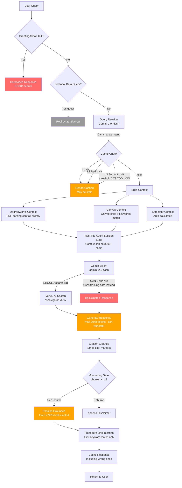
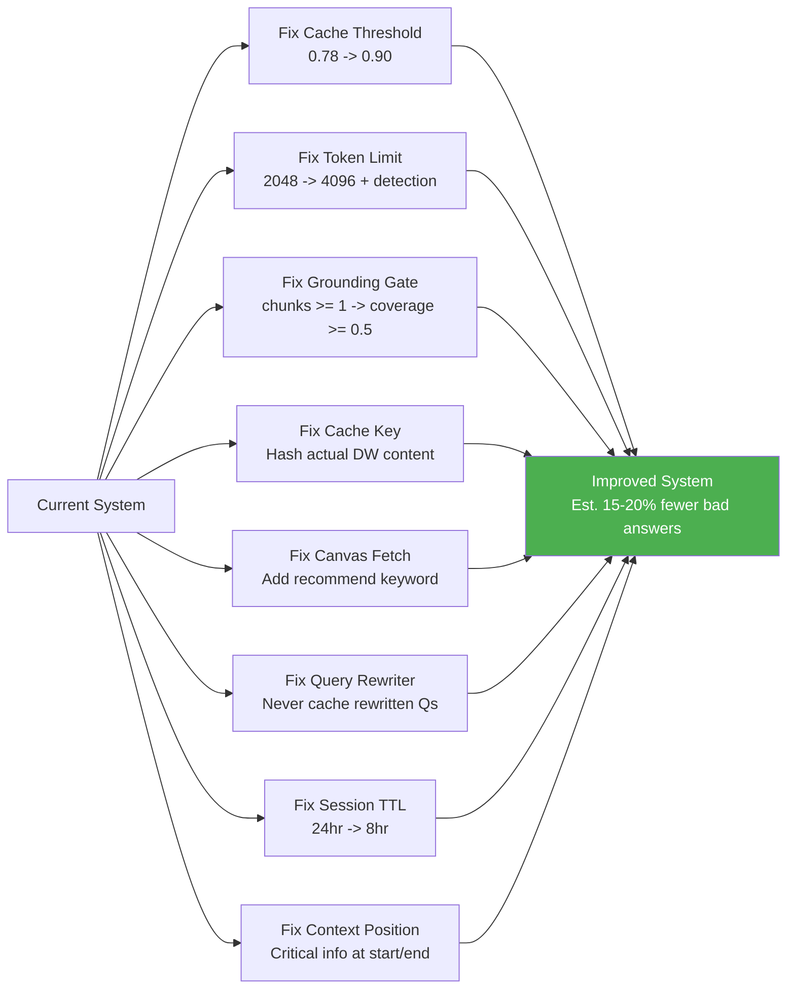
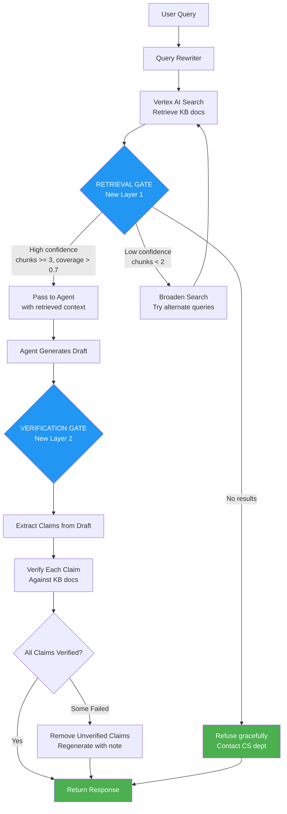
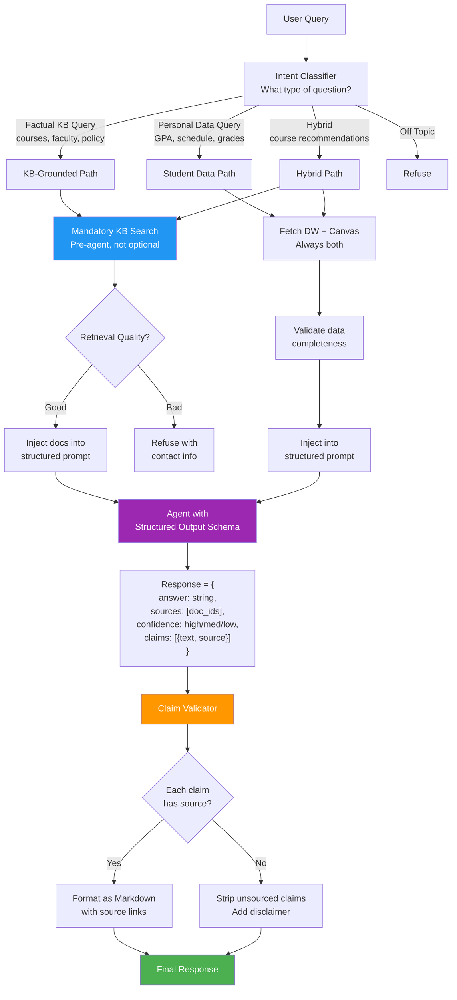

# CS Navigator Accuracy & Consistency Research Report
**Date:** April 8, 2026  
**Sources:** 23 academic papers, full codebase review (16 issues), Obsidian vault (v0-v5 history)

---

## Current Answer Pipeline & Where It Breaks



### Critical Failure Points (Red = breaks answer, Orange = degrades quality)

| # | Where | What Breaks | Severity |
|---|-------|-------------|----------|
| 1 | Cache (L3 semantic) | Threshold 0.78 matches COSC 220 to COSC 230 | CRITICAL |
| 2 | KB Search | Gemini CAN skip VertexAiSearchTool entirely | CRITICAL |
| 3 | Grounding Gate | 1 chunk = "grounded" even if 90% is hallucinated | HIGH |
| 4 | Token Limit | 2048 max_output_tokens truncates mid-sentence silently | HIGH |
| 5 | Query Rewriter | Can change user intent, wrong answer gets cached | HIGH |
| 6 | DegreeWorks Parse | PDF regex fails silently, completed courses list empty | HIGH |
| 7 | Canvas Fetch | Only triggered by keyword match, misses "recommend" queries | HIGH |
| 8 | Cache Key | Doesn't hash actual DW content, serves stale GPA/courses | HIGH |
| 9 | Session Reuse | 24hr TTL, ignores Canvas changes | MEDIUM |
| 10 | Context Position | Critical data may land in "lost in the middle" zone | MEDIUM |

---

## Research Findings (23 Papers Analyzed)

### Key Insight: WHY Gemini Ignores Retrieved Context
**Paper: ReDeEP (2025)** discovered the mechanism: Knowledge FFNs (feed-forward networks) inside the LLM **overpower** the Copying Heads that should integrate retrieved context. The model's parametric memory dominates over external knowledge. This is architectural, not a prompt engineering problem.

**Implication:** No amount of "ALWAYS search KB" instructions will force Gemini to use retrieved context if its internal knowledge pathway activates. We need structural enforcement.

### Key Insight: Single Agent > Multi-Agent for This Use Case
**Paper: Google Research (2026)** evaluated 180 agent configs. For sequential reasoning (which QA is), single-agent outperforms multi-agent. Multi-agent amplifies errors 17.2x with independent agents. Your v3 multi-agent was the right call to abandon.

### Key Insight: 57% of RAG Citations Are Post-Rationalized
**Paper: Correctness vs Faithfulness (2024)** found that up to 57% of citations in RAG systems are attached AFTER generation, not used DURING generation. The model generates text from parametric memory, then finds a citation that looks right. This explains why your grounding metadata shows chunks but the answer is still wrong.

### Top 8 Applicable Techniques (Ranked by Impact)

| Rank | Technique | Paper | Expected Impact |
|------|-----------|-------|-----------------|
| 1 | **CRAG: Retrieval Quality Gate** | Yan et al. 2024 | Prevents hallucination from bad retrieval |
| 2 | **Chain-of-Verification (CoVe)** | Meta AI 2023 | Catches hallucinated facts before returning |
| 3 | **Instruction Hierarchy** | OpenAI 2024 | Improves instruction following consistency |
| 4 | **Position-Aware Context** | Gemini "Lost in Middle" | Puts critical info at start/end, not middle |
| 5 | **Prompt Stability Testing** | 2025 | Measures and optimizes consistency |
| 6 | **Atomic Fact Validation** | FActScore/SAFE | Decomposes response into verifiable claims |
| 7 | **Structured Output with Source Fields** | SLOT 2025 | Forces grounding by requiring source citation |
| 8 | **Trust-Align: Learning to Refuse** | 2024 | Model refuses rather than hallucinating |

---

## Three Improvement Plans

### Plan A: "Tighten the Bolts" (1-2 days, no architecture change)

Fix the 10 code-level issues found in the review. No new patterns, just fixing bugs.



**Specific changes:**
1. `cache.py:44` - Raise `SEMANTIC_SIMILARITY_THRESHOLD` from 0.78 to 0.90
2. `agent.py:427` - Raise `max_output_tokens` from 2048 to 4096, add truncation detection
3. `vertex_agent.py:157` - Change grounding gate from `chunks >= 1` to `chunks >= 2 OR coverage >= 0.5`
4. `cache.py` - Hash actual DegreeWorks JSON content in cache key
5. `main.py:2385` - Add "recommend", "take", "next semester" to Canvas fetch keywords
6. `main.py:2757` - Cache under original query, not rewritten query
7. `vertex_agent.py:166` - Reduce SESSION_TTL to 28800 (8 hours)
8. Agent instruction restructure - put grounding rules and data sources at START, not after 300 words

**Pros:** Fast, low risk, fixes real bugs
**Cons:** Doesn't address fundamental issues (Gemini skipping KB, parametric memory dominance)

---

### Plan B: "Retrieval Gate + Verification Layer" (3-5 days, medium architecture change)

Inspired by CRAG + CoVe papers. Add two new layers to the pipeline.



**New components:**
1. **Retrieval Gate (before agent):** Runs KB search BEFORE sending to Gemini. Evaluates retrieval quality. If low confidence, tries alternate query formulations. If nothing found, refuses with contact info instead of hallucinating.

2. **Verification Gate (after agent):** Takes agent's draft response, extracts atomic claims (course names, phone numbers, locations, deadlines), verifies each against the KB docs that were retrieved. Removes unverified claims.

**Implementation:**
```python
# New file: backend/services/retrieval_gate.py
def evaluate_retrieval(query: str) -> RetrievalResult:
    """Search KB and evaluate quality before sending to agent."""
    results = vertex_search(query)
    if len(results.chunks) >= 3 and results.coverage > 0.7:
        return RetrievalResult(quality="high", docs=results)
    elif len(results.chunks) >= 1:
        # Try alternate queries
        alt_queries = generate_alternates(query)
        for alt in alt_queries:
            alt_results = vertex_search(alt)
            if alt_results.chunks >= 3:
                return RetrievalResult(quality="high", docs=merge(results, alt_results))
        return RetrievalResult(quality="low", docs=results)
    else:
        return RetrievalResult(quality="none", docs=None)

# New file: backend/services/verification_gate.py  
def verify_response(response: str, kb_docs: list) -> str:
    """Extract claims and verify against KB docs."""
    claims = extract_atomic_claims(response)  # Use Gemini to decompose
    verified = []
    for claim in claims:
        if claim_supported_by_docs(claim, kb_docs):
            verified.append(claim)
        else:
            verified.append(f"[unverified] {claim}")
    return reconstruct_response(verified)
```

**Pros:** Catches hallucinations before they reach users, retrieval gate prevents bad-retrieval-based answers
**Cons:** Adds 1-2 seconds latency (extra Gemini call for verification), more complex pipeline

---

### Plan C: "Structured Response Architecture" (1-2 weeks, major rewrite)

Inspired by SAFE + FLARE + Instruction Hierarchy. Complete pipeline redesign.



**Key changes:**
1. **Intent Classification** - Route queries to specialized paths instead of one-size-fits-all
2. **Mandatory Pre-Agent KB Search** - KB search happens BEFORE the agent, not as an optional tool
3. **Structured Output** - Agent outputs JSON with answer + sources + confidence + claims
4. **Claim-Level Validation** - Every factual claim must trace back to a KB document
5. **Separate Paths** - Factual queries, personal data queries, and hybrid queries each have optimized pipelines
6. **Always Fetch Both** - DegreeWorks AND Canvas fetched for any student query, not keyword-gated

**Agent instruction restructure (following Instruction Hierarchy paper):**
```
PRIORITY 1 (SYSTEM - NEVER OVERRIDE):
- Only use information from the RETRIEVED DOCUMENTS below
- If no documents provided, say "I don't have this information"
- Output MUST follow the structured schema

PRIORITY 2 (CONTEXT - per-request):
- Student data: [DegreeWorks JSON]
- Retrieved KB docs: [search results]
- Current semester: [auto-calculated]

PRIORITY 3 (USER - the actual question):
- [User's query]
```

**Pros:** Eliminates hallucination structurally (not just instructions), every claim is traceable, different query types get optimized handling
**Cons:** Major rewrite, adds latency, requires extensive testing, structured output can hurt naturalness

---

## Recommendation

**Start with Plan A immediately** (1-2 days). These are real bugs that cause wrong answers right now. The semantic cache threshold alone is probably causing a significant chunk of the inconsistency.

**Then implement Plan B** (3-5 days). The retrieval gate + verification layer addresses the fundamental issue that Gemini can skip KB search and hallucinate.

**Plan C is the long-term target** but should be a v6.0 effort with proper planning and testing.

---

## Code Review: Top 16 Issues Found

| # | Severity | File | Issue | User Impact |
|---|----------|------|-------|-------------|
| 1 | CRITICAL | cache.py:44 | Semantic threshold 0.78 too low | Wrong course info served |
| 2 | CRITICAL | cache.py:488 | Cache key ignores DW content | Stale GPA/courses |
| 3 | HIGH | agent.py:290 | KB search not enforced | Gemini skips KB, hallucinates |
| 4 | HIGH | vertex_agent.py:157 | Grounding gate: 1 chunk = grounded | Ungrounded answers pass |
| 5 | HIGH | query_rewriter.py:284 | Rewriter changes intent | Wrong cached answers |
| 6 | HIGH | agent.py:427 | max_output_tokens 2048 | Truncated mid-sentence |
| 7 | HIGH | cache.py:491 | Semantic cache threshold | Cross-course cache matches |
| 8 | MEDIUM | vertex_agent.py:442 | Citation cleanup strips sources | Lost provenance |
| 9 | MEDIUM | vertex_agent.py:64 | Procedure link greedy match | Missing guide links |
| 10 | MEDIUM | vertex_agent.py:251 | Session ignores Canvas changes | Stale deadlines |
| 11 | MEDIUM | main.py:2385 | Canvas only fetched on keywords | Missing grades for recs |
| 12 | MEDIUM | context_builders.py:323 | Empty context ambiguous | Misleading "sync" prompts |
| 13 | MEDIUM | main.py:2743 | Stream error overwrites response | Partial answers discarded |
| 14 | MEDIUM | vertex_agent.py:406 | Grounding metadata unvalidated | False grounding claims |
| 15 | MEDIUM | agent.py:318 | Multi-source instruction conflict | Wrong course recs |
| 16 | MEDIUM | vertex_agent.py:166 | 24hr session TTL too long | Stale student data |

---

## References

1. Yan et al. "Corrective RAG (CRAG)" - arXiv:2401.15884
2. Dhuliawala et al. "Chain-of-Verification" - arXiv:2309.11495 (Meta AI)
3. OpenAI "Instruction Hierarchy" - arXiv:2404.13208
4. Kim et al. "Scaling Agent Systems" - arXiv:2512.08296 (Google Research)
5. Cemri et al. "Why Multi-Agent Systems Fail" - arXiv:2503.13657 (NeurIPS 2025)
6. Manakul et al. "SelfCheckGPT" - arXiv:2303.08896 (EMNLP 2023)
7. Wei et al. "SAFE: Factuality Evaluator" - arXiv:2403.18802 (Google DeepMind)
8. Gao et al. "RARR: Researching and Revising" - ACL 2023
9. Min et al. "FActScore" - arXiv:2305.14251
10. Jiang et al. "FLARE" - arXiv:2305.06983 (EMNLP 2023)
11. "ReDeEP: Mechanistic Interpretability of RAG Hallucination" - OpenReview 2025
12. "Knowledge Conflicts in LLMs" - EMNLP 2024
13. "Correctness is not Faithfulness in RAG" - arXiv:2412.18004
14. "Trust-Score & Trust-Align" - arXiv:2409.11242
15. "Hallucination Mitigation in RAG: A Review" - MDPI Mathematics 2025
16. "AutoPDL: Automatic Prompt Optimization" - arXiv:2504.04365
17. "Prompt Stability Matters" - arXiv:2505.13546
18. "Prompt Engineering Patterns for Hallucination Reduction" - ResearchGate 2025
19. "Single-Agent > Multi-Agent on Multi-Hop Reasoning" - arXiv:2604.02460
20. "SLOT: Structuring LLM Output" - EMNLP 2025
21. "Grammar-Constrained Decoding" - ACL 2025
22. "KEDiT: Knowledge-Grounded Dialogue" - TACL 2025
23. Gemini hallucination reports - GitHub Issues + SparkCo analysis
