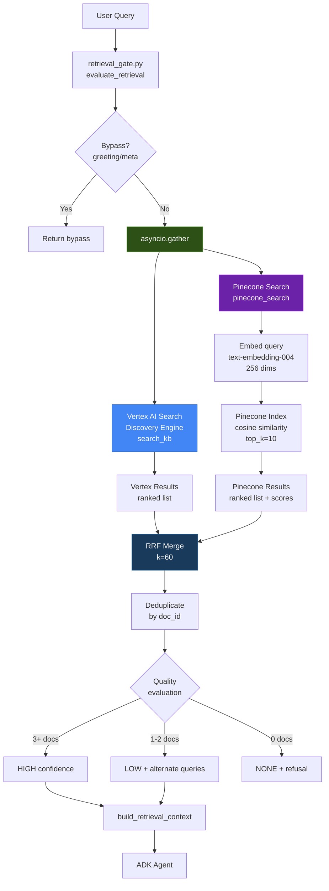

# Hybrid Retrieval System: Architecture Plan

**Author:** Aayush Shrestha
**Date:** 2026-04-08
**Status:** Proposed

## Overview

Replace the single-source Vertex AI Search retrieval with a parallel dual-source system: Pinecone (dense semantic search) + Vertex AI Search (structured keyword/BM25 search), merged via Reciprocal Rank Fusion (RRF). This gives us the best of both worlds: Pinecone catches semantically similar queries that keyword search misses, and Vertex AI Search catches exact-match structured data that embedding similarity might rank lower.

## System Diagram



## RRF Merge Algorithm

Reciprocal Rank Fusion combines ranked lists without needing score normalization. Each document gets a fused score based on its rank in each source list.

```python
def reciprocal_rank_fusion(
    vertex_results: list[dict],   # [{"doc_id": str, "text": str, ...}, ...]
    pinecone_results: list[dict], # [{"doc_id": str, "text": str, "score": float}, ...]
    k: int = 60,                  # RRF constant (standard default)
    top_n: int = 5,               # final results to return
) -> list[dict]:
    """
    Merge two ranked result lists using RRF.
    
    Score formula: RRF(d) = sum( 1 / (k + rank_i(d)) ) for each list i
    
    k=60 is the standard from the original Cormack et al. paper.
    Higher k = less aggressive preference for top-ranked items.
    """
    scores = {}  # doc_id -> {"score": float, "text": str, "sources": set}
    
    # Score Vertex AI Search results
    for rank, result in enumerate(vertex_results, start=1):
        doc_id = result["doc_id"]
        if doc_id not in scores:
            scores[doc_id] = {"score": 0.0, "text": result["text"], "sources": set()}
        scores[doc_id]["score"] += 1.0 / (k + rank)
        scores[doc_id]["sources"].add("vertex")
    
    # Score Pinecone results
    for rank, result in enumerate(pinecone_results, start=1):
        doc_id = result["doc_id"]
        if doc_id not in scores:
            scores[doc_id] = {"score": 0.0, "text": result["text"], "sources": set()}
        scores[doc_id]["score"] += 1.0 / (k + rank)
        scores[doc_id]["sources"].add("pinecone")
    
    # Sort by fused score descending, return top_n
    ranked = sorted(scores.items(), key=lambda x: x[1]["score"], reverse=True)
    return [
        {"doc_id": did, "text": data["text"], "rrf_score": data["score"], "sources": data["sources"]}
        for did, data in ranked[:top_n]
    ]
```

Why RRF over other fusion methods:
- No score normalization needed (Pinecone cosine scores and Vertex relevance scores are on different scales)
- Robust to outliers in either list
- Simple, fast, battle-tested in production search systems
- k=60 is the empirically optimal default from IR literature

## File Changes

### New Files

| File | Purpose |
|------|---------|
| `backend/services/pinecone_retrieval.py` | Pinecone client: embed query with text-embedding-004, search index, return normalized results |
| `backend/services/hybrid_retrieval.py` | RRF merge logic, parallel dispatch, dedup, fallback handling |
| `backend/scripts/reingest_to_pinecone.py` | One-shot migration script: fetch 71 docs from Vertex datastore, chunk, embed with text-embedding-004, upsert to Pinecone |

### Modified Files

| File | Change |
|------|--------|
| `backend/services/retrieval_gate.py` | Replace `search_kb()` call inside `evaluate_retrieval()` with `hybrid_search()` from `hybrid_retrieval.py`. Keep all quality evaluation logic, bypass logic, and alternate query logic unchanged. |
| `backend/requirements.txt` (or equivalent) | Add `pinecone` (if not already present for legacy_rag) |
| `.env` | Ensure `PINECONE_API_KEY`, `PINECONE_INDEX_NAME`, `PINECONE_ENV`, `PINECONE_NAMESPACE` are set |

### Files NOT Modified

| File | Reason |
|------|--------|
| `backend/legacy_rag/ingestion.py` | Legacy code stays as-is. New ingest script is separate and uses Google embeddings, not OpenAI. |
| `backend/cache.py` | Semantic cache is independent of retrieval. No changes needed. We reuse the same embedding model/approach but in a new file. |
| `backend/datastore_manager.py` | Used read-only by the reingest script. No modifications. |

## Detailed File Designs

### 1. `backend/services/pinecone_retrieval.py`

```python
"""
Pinecone semantic search using Google text-embedding-004.
Reuses the same embedding model as the semantic cache (cache.py)
but at 256 dims for Pinecone vectors too, keeping one vendor.
"""

# Key components:
# - _get_pinecone_index(): cached Pinecone client (lazy init, singleton)
# - _embed_query(text): Google genai text-embedding-004 @ 256 dims
# - search_pinecone(query, top_k=10) -> list[dict]
#     Returns: [{"doc_id": str, "text": str, "score": float, "metadata": dict}]
# - PINECONE_AVAILABLE: bool flag, set False if init fails (graceful degradation)
```

Embedding approach: identical to `cache.py` lines 299-319. Use `google.genai.Client(vertexai=True)` with `text-embedding-004` at 256 dimensions. This keeps us on one embedding vendor (Google) and matches the Pinecone index dimensionality after reingest.

### 2. `backend/services/hybrid_retrieval.py`

```python
"""
Hybrid retrieval: parallel Vertex AI Search + Pinecone, merged via RRF.
"""

# Key components:
# - hybrid_search(query, num_results=5) -> list[dict]
#     1. Fire both searches in parallel (asyncio.gather or ThreadPoolExecutor)
#     2. Normalize result formats to common schema
#     3. RRF merge
#     4. Deduplicate by doc_id (prefer the version with more text)
#     5. Return merged list
#
# - Fallback: if Pinecone is unavailable, return Vertex-only results
#             if Vertex is unavailable, return Pinecone-only results
#             if both down, return empty (retrieval_gate handles this as "none")
```

### 3. `backend/scripts/reingest_to_pinecone.py`

```python
"""
One-shot reingest: Vertex AI Search datastore -> Pinecone.
Run once to populate Pinecone with the same 71 docs.
Safe to re-run (idempotent via stable vector IDs).
"""

# Pipeline:
# 1. Fetch all 71 docs via datastore_manager._get_cached_contents()
# 2. For each doc:
#    a. Extract text (content field from raw_bytes)
#    b. Chunk with TokenTextSplitter (800 tokens, 150 overlap) -- same params as legacy
#    c. Embed each chunk with text-embedding-004 @ 256 dims
#    d. Upsert to Pinecone with metadata: {doc_id, title, category, chunk_index}
# 3. Vector IDs: f"{doc_id}-{chunk_index:05d}-{sha1(chunk)[:10]}" (same pattern as legacy)
# 4. Delete-before-upsert per doc_id (idempotent re-runs)
```

## Pinecone Index Configuration

The legacy index uses 1536 dims (OpenAI text-embedding-3-small). We need 256 dims (Google text-embedding-004). Two options:

**Option A (Recommended): New index**
- Create a new Pinecone index: `csnavigator-hybrid-v1`
- Dimension: 256
- Metric: cosine
- Namespace: `docs`
- Set `PINECONE_INDEX_NAME=csnavigator-hybrid-v1` in env

**Option B: Reuse existing index**
- Delete all vectors in the existing index
- Recreate with dim=256
- Risk: breaks legacy_rag if anyone still uses it

Option A is safer. The legacy index stays untouched as a rollback target. New index name makes the migration explicit.

## Latency Budget

```
Current (Vertex AI Search only):
  Query -> Vertex Search -> Extract text -> Return
  ~200-400ms total

Hybrid (parallel):
  Query -> [Vertex Search + (Embed + Pinecone Search)] -> RRF merge -> Return
  
  Vertex AI Search:    ~200-400ms
  Embed (Google API):  ~50-80ms
  Pinecone query:      ~30-50ms
  Embed + Pinecone:    ~80-130ms (sequential within Pinecone path)
  RRF merge + dedup:   ~1ms (in-memory)
  
  Total (parallel):    max(Vertex, Pinecone_path) + RRF
                       = max(300ms, 130ms) + 1ms
                       = ~300ms

Net impact: ~0ms added latency (Pinecone path finishes before Vertex)
Worst case: +50ms if Pinecone path is slow
```

The Pinecone path (embed + search) is almost always faster than Vertex AI Search, so parallel execution means we get hybrid results for essentially free latency.

## Fallback Strategy

```
Priority cascade:

1. Both sources available (normal):
   -> RRF merge, return fused results

2. Pinecone unavailable (API error, timeout, cold start):
   -> Log warning, return Vertex-only results
   -> retrieval_gate.py quality evaluation works unchanged
   -> User never sees a difference (just slightly less recall)

3. Vertex AI Search unavailable (GCP outage, quota):
   -> Log warning, return Pinecone-only results
   -> This is the real win: Pinecone on AWS acts as cross-cloud redundancy

4. Both unavailable:
   -> Return empty results
   -> retrieval_gate.py returns quality="none" with refusal message
   -> No hallucination risk
```

Implementation: wrap each search call in a try/except with a 3-second timeout. Use `asyncio.gather(return_exceptions=True)` so one failure doesn't cancel the other.

```python
vertex_results, pinecone_results = await asyncio.gather(
    search_vertex(query, num_results=10),
    search_pinecone(query, top_k=10),
    return_exceptions=True,
)

# If either returned an exception, treat as empty list
if isinstance(vertex_results, Exception):
    log.warning(f"Vertex search failed: {vertex_results}")
    vertex_results = []
if isinstance(pinecone_results, Exception):
    log.warning(f"Pinecone search failed: {pinecone_results}")
    pinecone_results = []
```

## Migration Steps (Ordered)

### Phase 1: Infrastructure (no production changes)

1. **Create new Pinecone index** (`csnavigator-hybrid-v1`, 256 dims, cosine, AWS us-east-1)
2. **Add env vars** to `.env` and Cloud Run:
   - `PINECONE_INDEX_NAME=csnavigator-hybrid-v1`
   - Verify `PINECONE_API_KEY` and `PINECONE_ENV` are set
3. **Write `backend/scripts/reingest_to_pinecone.py`**
4. **Run reingest locally** against the new Pinecone index
   - Verify: `index.describe_index_stats()` shows expected vector count
   - Expected: ~71 docs * ~3-5 chunks each = ~200-350 vectors
5. **Test Pinecone search locally** with sample queries, verify results make sense

### Phase 2: New retrieval modules (no production changes)

6. **Write `backend/services/pinecone_retrieval.py`**
   - Unit test: embed a query, search Pinecone, verify results return
7. **Write `backend/services/hybrid_retrieval.py`**
   - Unit test: mock both sources, verify RRF merge produces correct ranking
   - Unit test: mock Pinecone failure, verify Vertex-only fallback
   - Unit test: mock Vertex failure, verify Pinecone-only fallback

### Phase 3: Integration (production change, single file edit)

8. **Modify `backend/services/retrieval_gate.py`**:
   - Import `hybrid_search` from `hybrid_retrieval.py`
   - In `evaluate_retrieval()`, replace `results = search_kb(query)` with `results = hybrid_search(query)`
   - The `hybrid_search` function returns the same format as `search_kb` (list of results with extractable text), so `_extract_doc_text` and quality evaluation work unchanged
   - Keep `search_kb()` as a function (it's still used by hybrid_retrieval internally)

9. **Test locally end-to-end**: run the backend, send queries through `/chat/guest`, verify:
   - Hybrid results include docs from both sources
   - Latency is not degraded
   - Fallback works when Pinecone is intentionally killed

### Phase 4: Deploy

10. **Deploy to Cloud Run** (follow existing deploy checklist: ADK -> Backend -> Frontend)
11. **Set Pinecone env vars** on Cloud Run backend service
12. **Clear Redis cache** (old cached answers may be stale)
13. **Monitor logs** for Pinecone errors, RRF merge stats, latency

### Phase 5: Ongoing

14. **Keep Pinecone in sync**: when KB docs are updated via admin dashboard (`datastore_manager.upload_document` / `update_document`), also re-embed and upsert to Pinecone. Add a hook in `datastore_manager.py` or in the admin endpoint in `main.py`.
15. **Tune RRF k parameter**: log both source rankings and final RRF ranking, compare against user satisfaction / accuracy metrics. k=60 is the starting point.

## Open Questions

1. **Chunk size**: Legacy uses 800 tokens with GPT tokenizer. Should we keep 800 or adjust for Google's tokenizer? Recommendation: keep 800 for now, it's proven to work.

2. **Namespace strategy**: Use `docs` namespace (same as legacy) or create `hybrid-v1`? Recommendation: `docs` is fine since this is a new index.

3. **Pinecone tier**: Free tier supports 1 index with 100K vectors. Our ~300 vectors are well within limits. No paid tier needed.

4. **Real-time sync vs batch**: Should KB edits trigger immediate Pinecone upserts, or is a nightly batch acceptable? Recommendation: immediate upserts (71 docs change rarely, maybe 1-2 per week, so the overhead is negligible).
